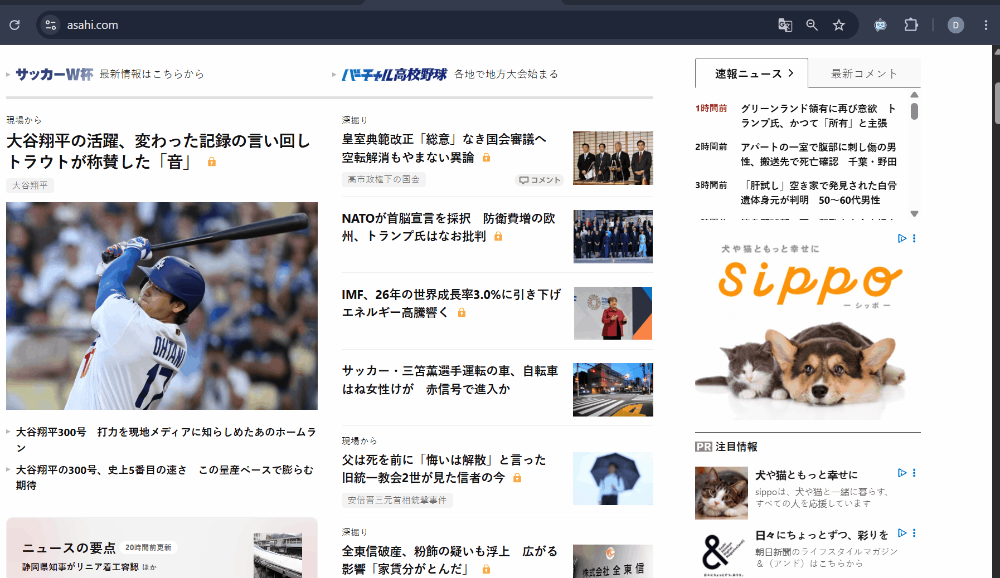
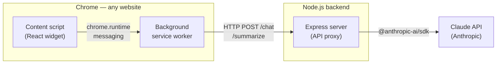

# AI Chat Widget — Chrome Extension

A Chrome extension that adds an AI assistant to any website. It reads the page you're on and answers questions about it using the Claude API — with multi-turn conversation history, automatic summarization of older messages, and Markdown-formatted answers.


## Demo



## Features

- **Works on any website**: injected as a content script, toggled with a floating button in the corner of the page
- **Page-aware answers**: sends the current page's URL, title, and visible text to the model, so you can ask content aware questions, like: "summarize this article" or "what is the correct answer here?"
- **Multi-turn conversations with context management**: recent messages are sent as is, but once the history grows past a threshold, older messages are automatically sumarized to keep token usage low
- **Markdown-formatted answers**: headings, lists, code blocks, and tables render properly inside the chat bubble
- **Persistent history**: conversations survive page reloads and browser restarts via `chrome.storage`
- **Extension popup controls**: an on/off toggle for the widget and a button that reloads the widget, without touching `chrome://extensions`
- **Debug mode**: set `DEBUG=true` on the server to emulate API responses, so you can develop the UI without spending tokens

## Architecture



**Why a backend proxy?** The Anthropic API key never ships inside the extension. So the API key lives only on the server (`.env`), and the extension talks to the API only through the Express proxy. Moreover, the system prompt, page context, and conversation summary are assembled server-side.

**How a message flows:**

1. The React widget (content script) collects your message plus page context (URL, title, first 3,000 chars of visible text) and recent chat history
2. It passes everything to the background service worker via `chrome.runtime.sendMessage` — in Manifest V3 the service worker is the extension's background layer, so network requests go out from the extension's own context rather than from webpage, and behave the same on every site
3. The service worker POSTs to the Express server's `/chat` endpoint
4. The server builds the system prompt (assistant instructions + conversation summary + page context) and calls Claude via the official SDK
5. The answer travels back the same path and renders as Markdown in the widget

**Context-window management:** once a conversation exceeds 10 messages, everything except the 6 most recent is sent to the `/summarize` endpoint, which compresses it into a 2–3 sentence summary. That summary rides along in the system prompt of every subsequent request, so long conversations keep their context without growing the payload.

## Backend Server

[`server.js`](server.js) is a small Express app that owns the API key and all prompt construction. Three endpoints:

| Method | Endpoint     | Purpose                                                                  |
| ------ | ------------ | ------------------------------------------------------------------------ |
| GET    | `/`          | Health check - reports if the server is in `live` or `debug` mode   |
| POST   | `/chat`      | Main chat endpoint - builds the prompt and queries Claude                 |
| POST   | `/summarize` | Compresses older conversation turns into a short running summary          |

### `POST /chat`

```jsonc
// Request
{
  "message": "What is this page about?",              // required
  "context": {                                        // optional page context
    "url": "https://example.com",
    "title": "Example",
    "pageText": "first ~3,000 chars of visible text"
  },
  "recentHistory": [                                  // last few turns, complete 
    { "role": "user", "text": "..." },
    { "role": "bot",  "text": "..." }
  ],
  "summary": "compressed summary of older turns"      // optional
}

// Response
{ "answer": "Markdown-formatted answer" }
```

The system prompt is assembled in three layers - base assistant instructions, then the conversation summary (if any), then the page context - and sent to `claude-haiku-4-5` together with `recentHistory` plus the new message as the conversation. Errors return `400` (missing message) or `502` (upstream API failure).

### `POST /summarize`

Takes `{ "messages": [{ "role", "text" }, ...] }`, returns `{ "summary": "..." }` - a 2–3 sentence compression that the client appends to its running summary.

### Environment variables (`.env`)

| Variable            | Default | Purpose                                                        |
| ------------------- | ------- | -------------------------------------------------------------- |
| `ANTHROPIC_API_KEY` | —       | Required in live mode                                           |
| `PORT`              | `3000`  | Server port                                                     |
| `DEBUG`             | `false` | `true` = return mock responses without calling the Claude API   |

In debug mode the server never instantiates the Anthropic client - `/chat` echoes back the message and page context it received, so you can verify the whole extension -> server pipeline without spending tokens.

## Tech Stack & Project Structure

**Extension (frontend):** React 19 · Vite 8 · react-markdown + remark-gfm · Chrome Extension Manifest V3
**Backend:** Node.js · Express 5 · @anthropic-ai/sdk · dotenv · cors

```
Ai_Chat_Widget/
├── server.js                      # Express API proxy — owns the API key and prompt construction
├── .env                           # ANTHROPIC_API_KEY, PORT, DEBUG (not committed)
├── docs/                          # README assets (demo GIF)
└── widget-app/                    # Chrome extension (React + Vite)
    ├── public/
    │   ├── manifest.json          # Manifest V3 config
    │   ├── popup.js               # Toolbar popup logic (global toggle + page reload)
    │   └── icons/
    ├── index.html                 # Toolbar popup markup
    ├── src/
    │   ├── background/
    │   │   └── service-worker.js  # All network calls to the backend live here
    │   └── content/
    │       ├── main.jsx           # Injects the widget root into the host page
    │       ├── App.jsx            # Chat UI, history persistence, summarization logic
    │       └── App.css            # Widget styles, scoped under the root element id
    └── vite.config.js             # Builds content script, service worker, and popup
```

---
 
## Prerequisites
 
- [Node.js](https://nodejs.org/) v18 or higher
- npm v9 or higher
- Google Chrome
---
 
## Setup
 
### 1. Install dependencies
 
From the project root, install both the root and frontend dependencies:
 
```bash
# Root (server dependencies)
npm install
 
# Frontend
cd widget-app
npm install
```
 
### 2. Build the extension
 
```bash
# Inside widget-app/
npm run build
```
 
This generates the `widget-app/dist/` folder - the built extension Chrome will load.
 
### 3. Load the extension in Chrome
 
1. Open Chrome and go to `chrome://extensions/`
2. Enable **Developer mode** (toggle in the top-right corner)
3. Click **Load unpacked**
4. Select the `widget-app/dist/` folder
5. The extension icon will appear in your Chrome toolbar
### 4. Start the backend server
 
```bash
# From the project root
node server.js
```
 
The server runs on `http://localhost:3000` by default.
 
---
 
## Development Workflow
 
### Rebuilding after changes
 
Every time you edit the frontend, rebuild and refresh the extension:
 
```bash
# Inside widget-app/
npm run build
```
 
Then go to `chrome://extensions/` and click the **refresh icon** (↺) on the extension card.
 
### Watch mode (auto-rebuild)
 
```bash
# Inside widget-app/
npm run build -- --watch
```
 
> You still need to manually refresh the extension in `chrome://extensions/` after each rebuild - Chrome does not hot-reload extensions automatically.

---

## Roadmap

- [ ] **Multiple chats** - create, switch between, and delete separate conversations, each with its own history and summary
- [ ] **Ask about a selection** - select a text passage or an element on the page (e.g. an image, a table) and ask the assistant about that specific content instead of the whole page
- [ ] **Streaming responses** - stream the answer token-by-token instead of waiting for the full reply
- [ ] **Shadow DOM isolation** - render the widget inside a shadow root so host-page styles can never leak into it (or out of it)
- [ ] **Server hardening** - rate limiting and request authentication, so a deployed proxy can't be abused by third parties